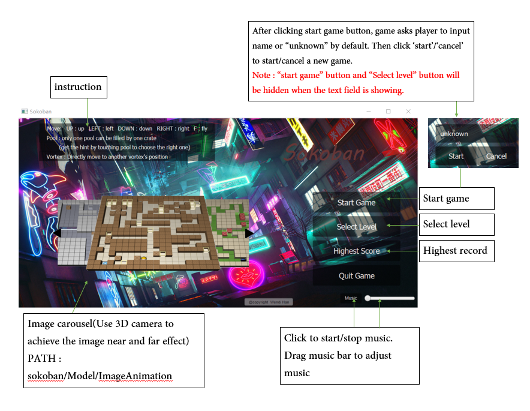
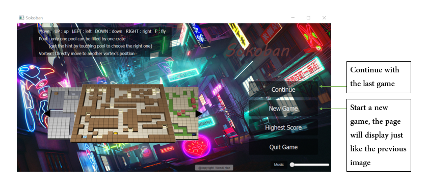
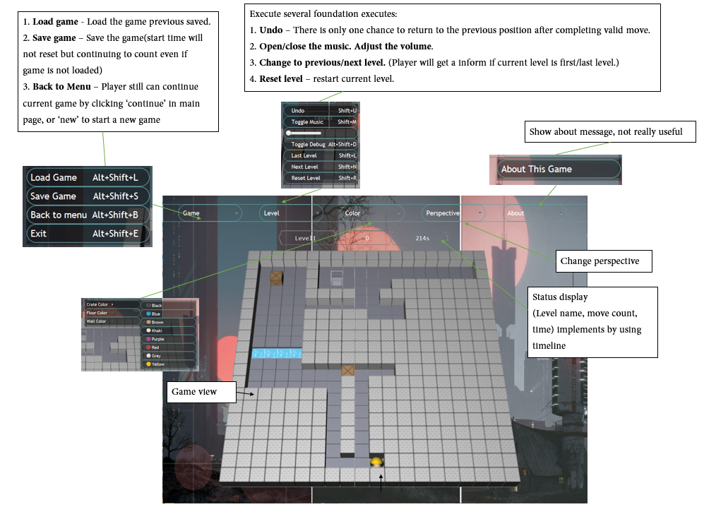
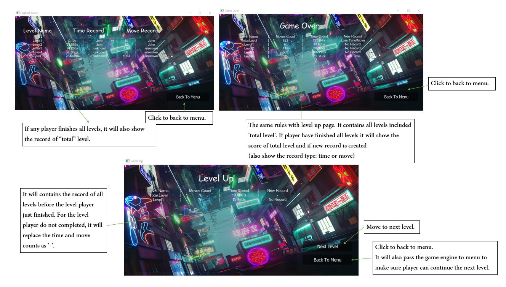
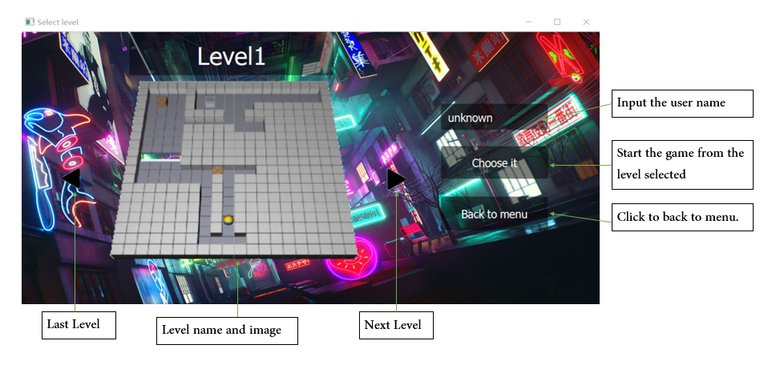
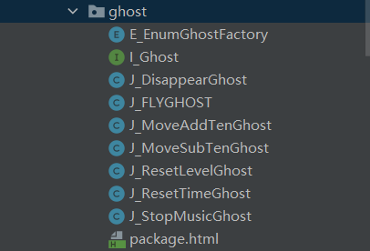
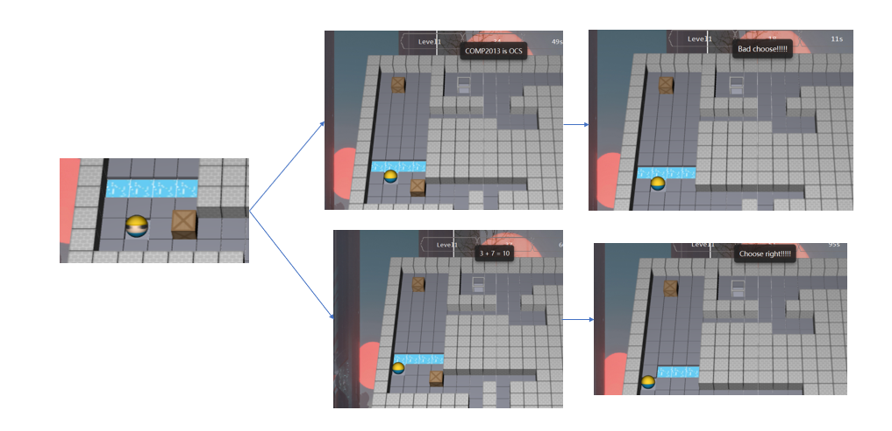
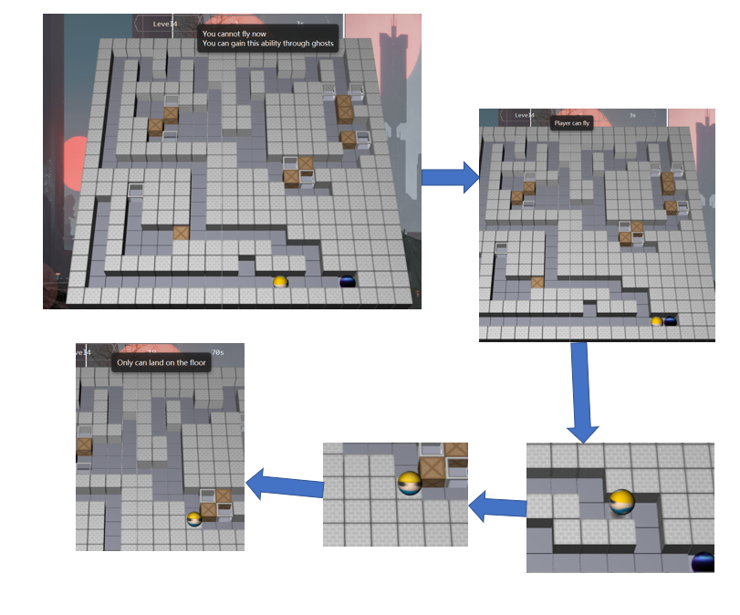
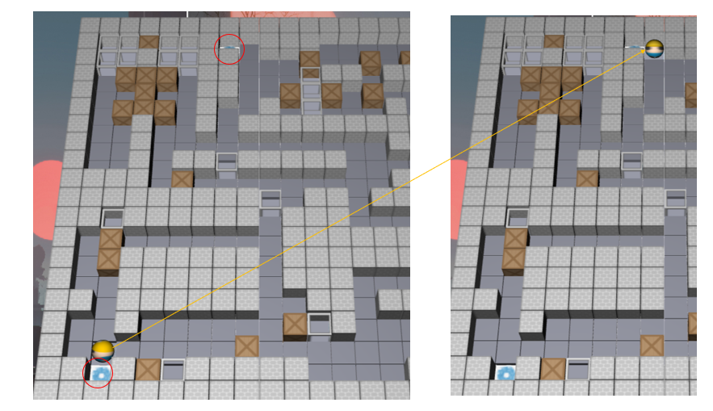

# 	Sokoban Game

## Table of Contents

 Section | Content 
 :- | -- 
 [Fundamental](#fundamental) |  
[Game pages and basic features](#game_look) | -  [Main page](#mainpageview) -  [Main page(Returned from the game view)](#mainpageafterreturn) -  [Game page](#gamepage) -  [Message page](#messagepage) -  [Select level page](#selectlevelpage) 
[Function Introduction](#function) | -  [Messsage](#functionmessage) -  [Game](#functiongame) -  [Additional Layouts/function](#functionlayout) 

## Fundamental

#### Name : Wendi Han

#### ID: 20126355

#### Word counts(except catalog, link tag and images) : ≈ 480words.

#### JavaDoc : Docs/index.html

#### Test : Windows, Intellij idea, Maven, java 14, javafx 13

#### Compile Detail(if cannot run):  

- Normally, it will automatic download the javafx resources and test package I needed because I add dependence on the 'pom.xml'

- If it is not work and shows javafx class cannot be recognized, please re-download the sources from  remote warehouse

- If game cannot play, try to set follow option:  the java JDK version I use is 14, 

  bytecode version 14	-    In *"settings - compiler - java compile  - target bytecode version : 14"*

  project Sdk : 14   -   In *"project structure - project - project SDK : 14"*

  project language level :  14   -   In *"project structure - project - project language level : 14"*

  Module SDK : 14   -   In *"project structure - module- module SDK : 14"*

- If it shows the error about openjfx version 0.05, please open the main/Main.java and run Main.main()
- If above setting cannot make it work, please contact with me : scywh1@nottingham.ac.uk

##  Game pages and basic features

-------------------------

### 												Main page

-----------------------------------

### 															Main page(Returned from the game view)

-------------------------

### 													Game page

--------------

### 													Message page

----------------------

###																											Select level page

## Function Introduction

### Message

- #### Highest record

  - Permanent highest score list save in  *"src/main/resources/RECORD/high_score.skb"*
  - Load once and save in the class *"sokoban/Model/RECORD/J_HighestSave.java"*. This class will be update and write the data into file during the game by calling load/judge/save function in *"sokoban/Model/RECORD/J_Data.java"*

- #### Level up / Victory message

  - see *"sokoban/Model/message"*.
  - View and basic feature see [here](#messagepage).
  - Judge with the highest score after finishing each level and show to player(if create new record then update in  *J_HighestSave.java*  and update in file).

- ####  Inform 

  - See *"sokoban/Model/game/J_Tooltip"*
  - Give some informs e.g. user touch the ghost(see later).

### Game

- #### Back to menu

  - See [here](#mainpageafterreturn)
  - Player can temporarily back to menu and continue the last game.

- ### Last/Next Level

  - See [here](#gamepage)
  - The record of current level will set to unfinished.

- ### Reset/Undo

  - See [here](#gamepage)
  - Reset current level/ Return to last position(only one chance after valid moving)

- ### Color choose

  - See [here](#gamepage)
  - *"sokoban/Model/gameEngine/object/J_Image.java"* saves all the image used in game.
  - *"sokoban/Model/gamEngine/object/J_Color.java"* saves **the current color of objects** and **player direction**.

- ### Status display

  - See [here](#gamepage)
  
- ### Load/Save game

  - See [here](#gamepage)
  - Cannot use self-designed file - will give a inform about loading fail

### Additional Layouts/function

- #### Ghost

  - See  *"sokoban/Model/gameEngine/object/ghost"*

    

  - Seven types, each time player touch the ghost, a different effect will be **generated randomly**. **Ghost will not disappear until the effect is disappear.**

  - Undo will not eliminate the effect.

- #### Pool

  - See *"sokoban/Model/gameEngine/object/E_GameObject"*
  - Pool proposition saved in *"sokoban/Model/level/J_PoolStatementSingleton"*, randomly distribute to each pool in *"sokoban/Model/level/J_Level/createPoolProposition()"*
  - Shallow pool can be **filled by one crate**, and the deep pool cannot be filled. 
      **player cannot pass** the pool until it be filled.
  - Each pool has a proposition(only one is truth), and user need to touch it to get the proposition and judge which
    is the shallow one
  - After being filled pool will change to wall and crate disappear, undo can reset this operation.
  - 

- #### Fly

  - See *"sokoban/Model/game/J_GameEngine"*
  - User can fly after gaining the ability from ghost. Use "F" to fly or land(only can land on the floor)
  - If player's last operation is play/land, undo will let player back to last status.
  - Cannot do something except touch the ghost during fly.
  - 

- #### Pipeline

  - See *"sokoban/Model/gameEngine/object/E_GameObejct"*
  - Go straight to the other location.
  - 

